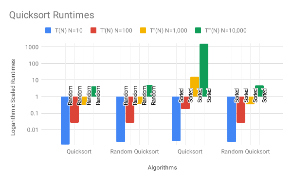

# Algorithms Programming Assignment

I rendered this README as a PDF to make it easier on the eyes in case you don't have a Markdown renderer.

## Part A
### Running the program

Running the following command in the project directory will compile the binary for __Part A__, then run it.
```
make sort-program
```

You will be prompted to generate increasing numbers [y/n]
- if you enter a `y` the program will prompt for __N__, and __X__, then generate a list of increasing numbers using the formula `A[i] = N + (i)X`
- if you enter a `n`, the program will prompt for __N__, and it will randomly generate __N__ integers as input to the sorting functions.

### Part A - Option 1a
An example run for Part A - option 1a should look like this:
```
$ make sort-program
make bin/sort-program
make[1]: Entering directory '...'
g++ -std=c++11 -c -g -Iinclude -o obj/main.o src/main.cpp
g++ -std=c++11 -c -g -Iinclude -o obj/utils.o src/utils.cpp
g++ -std=c++11 -c -g -Iinclude -o obj/sort.o src/sort.cpp
g++ -std=c++11 -o bin/sort-program obj/main.o obj/utils.o obj/sort.o
make[1]: Leaving directory '...'
bin/sort-program
Generate increasing integers? [y/n] y
Enter N: 10
Enter X: 2
The results have been written to output.txt
```

And the corresponding output text should look something like this:
```
Original:
[12, 14, 16, 18, 20, 22, 24, 26, 28, 30]

Quicksort Results:
[12, 14, 16, 18, 20, 22, 24, 26, 28, 30]
Runtime(ms): 0.011075

Randomized Quicksort Results:
[12, 14, 16, 18, 20, 22, 24, 26, 28, 30]
Runtime(ms): 0.008679
```

### Part A - Option 1b
An example run for Part A - option 1b should look like this:
```bash
$ make sort-program
make bin/sort-program
make[1]: Entering directory '...'
g++ -std=c++11 -c -g -Iinclude -o obj/main.o src/main.cpp
g++ -std=c++11 -c -g -Iinclude -o obj/utils.o src/utils.cpp
g++ -std=c++11 -c -g -Iinclude -o obj/sort.o src/sort.cpp
g++ -std=c++11 -o bin/sort-program obj/main.o obj/utils.o obj/sort.o
make[1]: Leaving directory '...'
bin/sort-program
Generate increasing integers? [y/n] n
Enter N: 10
The results have been written to output.txt
```

And the corresponding output text should look something like this:
```
Original:
[5340, 9543, 8414, 4868, 8427, 8467, 4793, 901, 1582, 837]

Quicksort Results:
[837, 901, 1582, 4793, 4868, 5340, 8414, 8427, 8467, 9543]
Runtime(ms): 0.006724

Randomized Quicksort Results:
[837, 901, 1582, 4793, 4868, 5340, 8414, 8427, 8467, 9543]
Runtime(ms): 0.008876
```

Part A of the assignment involves the following files:
```
bin/
    sort-program
include/
    sort.hpp
    utils.hpp
src/
    main.cpp
    sort.cpp
    utils.cpp
Makefile
output.txt
```

### Running the tests
I wrote some tests as I was adapting the Chapter 7 pseudocode for quicksort and randomized quicksort in order to make sure I had done them right. The test runs quicksort and randomized quicksort 2000 times each on randomly sized arrays of [1, 10000] random integers between [0, 10000].

After running this test several times, I could be reasonably sure that they behave as expected. If you would like to run this test, an example run is listed below.

```
$ make test
make bin/test
make[1]: Entering directory '...'
g++ -std=c++11 -c -g -Iinclude -o obj/test.o src/test.cpp
g++ -std=c++11 -c -g -Iinclude -o obj/utils.o src/utils.cpp
g++ -std=c++11 -c -g -Iinclude -o obj/sort.o src/sort.cpp
g++ -std=c++11 -o bin/test obj/test.o obj/utils.o obj/sort.o
make[1]: Leaving directory '...'
bin/test
Running Randomized Quicksort check...
Finished Randomized Quicksort check!
 - pass: 2000
 - fail: 0
 - average runtime(ms): 2.20671

Running Quicksort check...
Finished Quicksort check!
 - pass: 2000
 - fail: 0
 - average runtime(ms): 1.92607
```

The test for Part A of the assignment involves the following files:
```
bin/
    test
include/
    sort.hpp
    utils.hpp
src/
    test.cpp
    sort.cpp
    utils.cpp
Makefile
```

## Part B
### Benchmarks program
I wrote a program for the first 4 tasks of this part in order to make things easier. Here's an example run of the program

```
$ make bench
make bin/bench
make[1]: Entering directory '...'
g++ -std=c++11 -c -g -Iinclude -o obj/bench.o src/bench.cpp
g++ -std=c++11 -c -g -Iinclude -o obj/utils.o src/utils.cpp
g++ -std=c++11 -c -g -Iinclude -o obj/sort.o src/sort.cpp
g++ -std=c++11 -o bin/bench obj/bench.o obj/utils.o obj/sort.o
make[1]: Leaving directory '...'
bin/bench

Benchmarks [Quicksort with Random Input]
Running N = 10 ...
runs: 5
 - total runtime(ms): 0.006054
 - average runtime(ms): 0.0012108

Running N = 100 ...
runs: 5
 - total runtime(ms): 0.132619
 - average runtime(ms): 0.0265238

Running N = 1000 ...
runs: 5
 - total runtime(ms): 1.60865
 - average runtime(ms): 0.32173

Running N = 10000 ...
runs: 5
 - total runtime(ms): 21.3953
 - average runtime(ms): 4.27906


Benchmarks [Randomized Quicksort with Random Input]
Running N = 10 ...
runs: 5
 - total runtime(ms): 0.008654
 - average runtime(ms): 0.0017308

Running N = 100 ...
runs: 5
 - total runtime(ms): 0.126551
 - average runtime(ms): 0.0253102

Running N = 1000 ...
runs: 5
 - total runtime(ms): 1.85518
 - average runtime(ms): 0.371036

Running N = 10000 ...
runs: 5
 - total runtime(ms): 26.0233
 - average runtime(ms): 5.20466


Benchmarks [Quicksort with Sorted Input]
Running N = 10 ...
runs: 5
 - total runtime(ms): 0.010303
 - average runtime(ms): 0.0020606

Running N = 100 ...
runs: 5
 - total runtime(ms): 0.864826
 - average runtime(ms): 0.172965

Running N = 1000 ...
runs: 5
 - total runtime(ms): 82.5397
 - average runtime(ms): 16.5079

Running N = 10000 ...
runs: 5
 - total runtime(ms): 8041.26
 - average runtime(ms): 1608.25


Benchmarks [Randomized Quicksort with Sorted Input]
Running N = 10 ...
runs: 5
 - total runtime(ms): 0.008539
 - average runtime(ms): 0.0017078

Running N = 100 ...
runs: 5
 - total runtime(ms): 0.129852
 - average runtime(ms): 0.0259704

Running N = 1000 ...
runs: 5
 - total runtime(ms): 1.66435
 - average runtime(ms): 0.332871

Running N = 10000 ...
runs: 5
 - total runtime(ms): 23.6
 - average runtime(ms): 4.72
```

### Plots
The runtimes for this example run were the ones I included in the report.

Using a Google Sheets spreadsheet, I was able to generate a chart with a Logarithmic vertical axis to compare the algorithms and their inputs.



The benchmarks for Part B of the assignment involve the following files:
```
bin/
    bench
include/
    sort.hpp
    utils.hpp
src/
    bench.cpp
    sort.cpp
    utils.cpp
Makefile
```

## Clean
If, for some reason, you need to clean the project and start fresh, you can run the following command to delete all binaries and object files that were generated during the compile step.
```
make clean
```